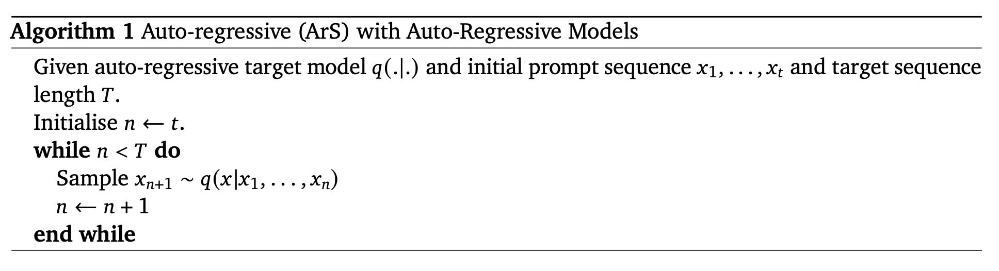
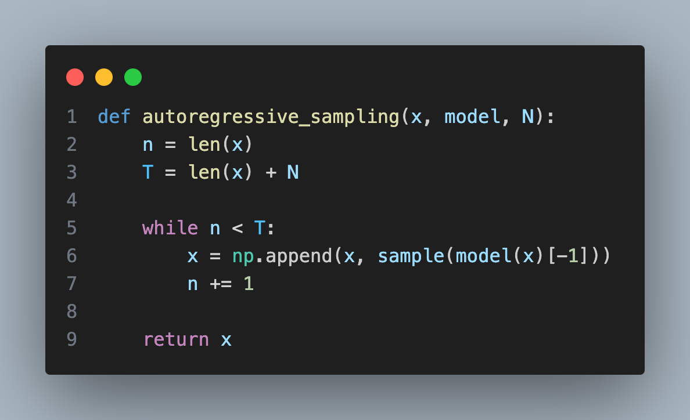
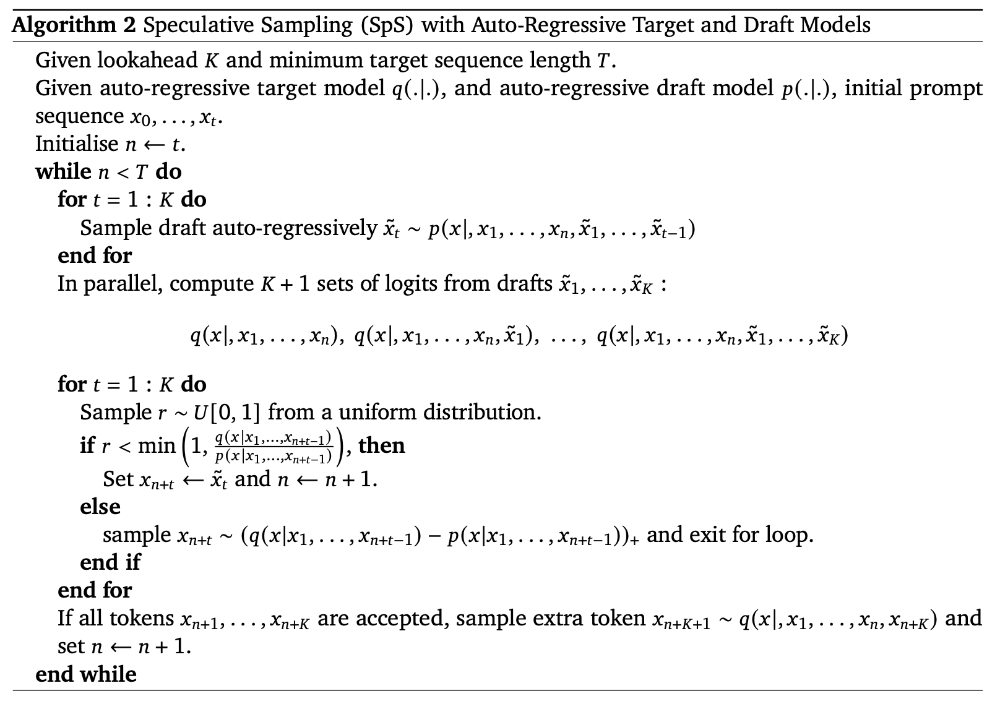
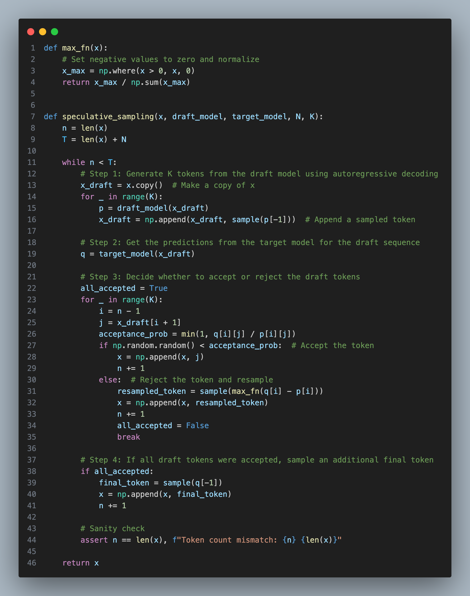
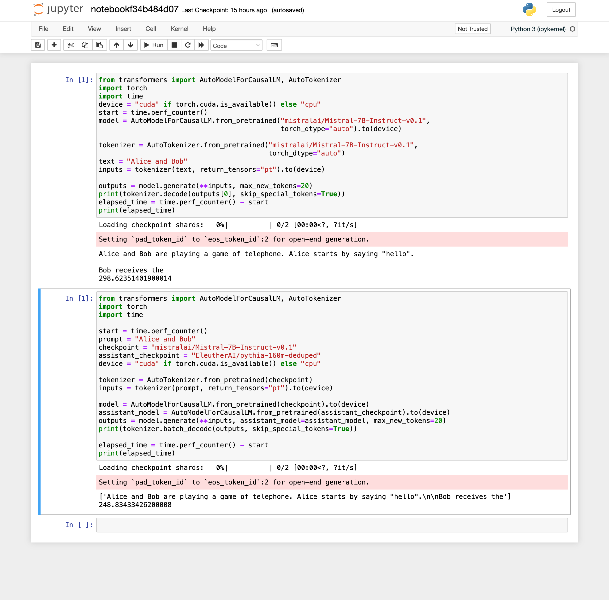
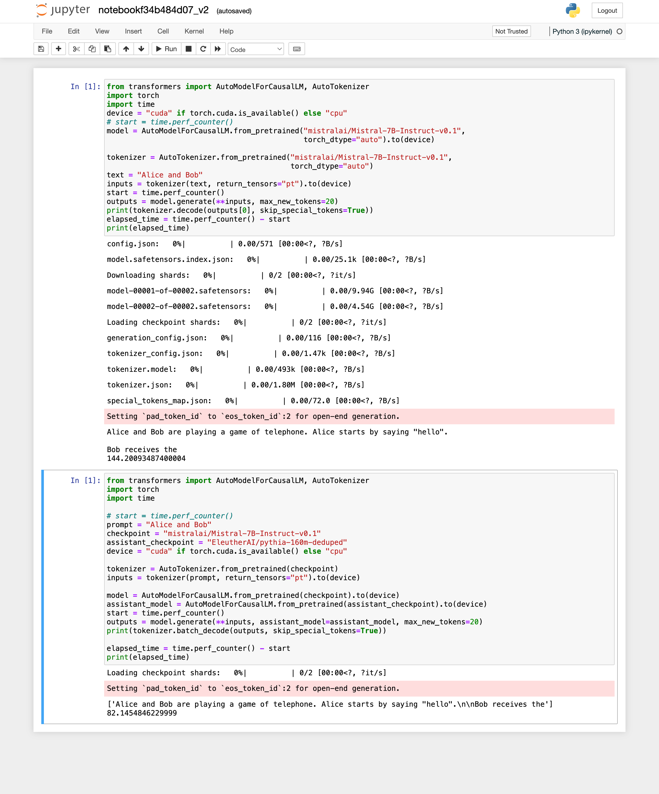
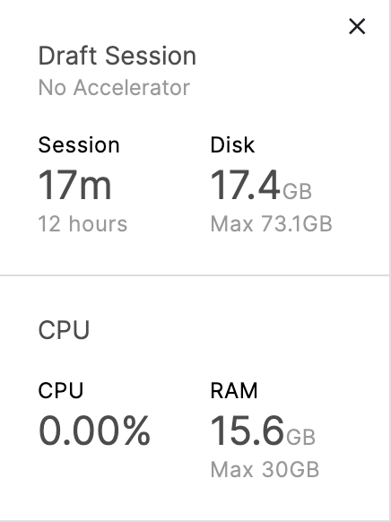
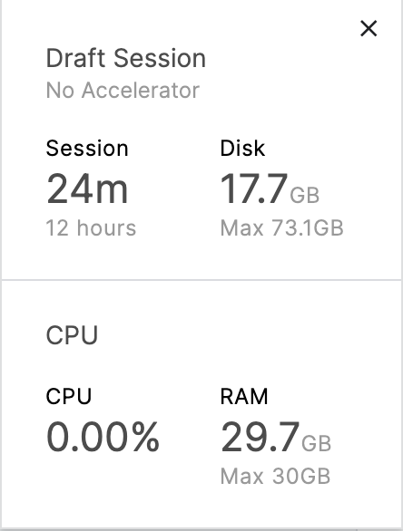
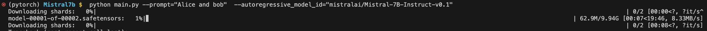
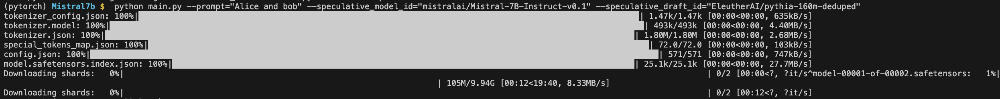

# Mistral7b

Mistral7b - A powerful LLM with 7B parameters.

Requirements to run Mistral7B

| Name    | Number of parameters | Number of active parameters | Min. GPU RAM for inference (GB) |
| -------- | ------- |-------- | ------- |
| Mistral-7B-v0.2  | 7.3B    |   7.3B      |   16      |

My system is mac m1 (ARM, 16GB RAM). 
The codebase of Mistral7B is programmed for cuda based systems.
However, debugged the code to run on MPS(ARM). But some complex types are not allowed with the MPS and the program crashed. 

Tried to run using the CPU only, however zsh is getting killed due to shortage of memory.

Finally tried with kaggle notebook which has memory limit upto 30GB.

The notebook in this repository contains the code to run the plain(autoregressive sampling) mistral7b and mistral7b with speculative sampling and compares the inference time for two approaches.

Autoregressive sampling:

The standard way of generating text from the language model is using the autoregressive sampling. The algorithm for the same is shown below[4].

In code

Where:

`x` is a list of integers representing the token ids of the input text.

`model` is a language model (Mistral7B) that accepts as input a list of token ids of length `seq_len` and outputs a matrix of probabilities of shape `[seq_len, vocab_size]`.

`N` is the number of tokens we want to decode.

Speculative sampling:

In speculative sampling we have two models:

1. A smaller, faster draft model (e.g. DeepMind's 7B Chinchilla model)
2. A larger, slower target model (e.g. DeepMind's 70B Chinchilla model)

However, I am not able to find mistral7B light weight model, which we need for draft model(assistant model). Instead I have used 
`EleutherAI/pythia-160m-deduped[5][6]` as the assitant model since it is small and lightweight model with only 160m parameters.

The concept revolves around the draft model projecting potential future outputs, with the target model specifying the number of these predictions to consider.

1. The draft model sequentially generates tokens using the standard autoregressive approach.
2. Probability outputs of both the target and draft models are obtained for the newly predicted sequence.
3. Comparing the probabilities from both models helps decide how many tokens to retain based on specific rejection criteria. Rejected tokens are resampled by combining the distributions of both models, halting the acceptance of further tokens.
4. If all tokens are accepted, an additional final token can be sampled from the probability output of the target model.

Algorithm[4]:

Code:

The autoregressive regressive sampling and speculative sampling is implemented below using the huggingface library and the time it took for two approaches are printed along with the output text. [notebookf34b484d07_v1.ipynb]

If we change the starting time position we get the below output.[notebookf34b484d07_v2.ipynb]

Things to note from the above execution

| Name    | Time it took for autoregressive | Time it took for speculative sampling | 
| -------- | ------- |-------- |
| notebookf34b484d07_v1.ipynb  | 298.62    |   248.83    |
| notebookf34b484d07_v2.ipynb  | 144.20    |   82.14    |

By utilizing the assistive model during speculative sampling, the time has been cut down from 144.2 to 82.14, marking a 43% decrease in inference time.

Memory footprint

Autoregressive

Speculative sampling

To view, run and reproduce the result please follow the below link

https://www.kaggle.com/code/manojkolpe/notebook3205925835

To run locally please run the below code:

Autoregressive

`python main.py --prompt="Alice and bob"  --autoregressive_model_id="mistralai/Mistral-7B-Instruct-v0.1"` 

Speculative sampling

`python main.py --prompt="Alice and bob" --speculative_model_id="mistralai/Mistral-7B-Instruct-v0.1" --speculative_draft_id="EleutherAI/pythia-160m-deduped"`

References:

1. https://jaykmody.com/blog/speculative-sampling/ 
2. https://docs.mistral.ai/models
3. https://www.youtube.com/watch?v=q6oiidmVnwE&ab_channel=DataScienceCastnet
4. https://arxiv.org/pdf/2302.01318.pdf
5. https://github.com/EleutherAI/pythia
6. https://arxiv.org/pdf/2304.01373.pdf
7. https://github.com/shreyansh26/Speculative-Sampling 
8. 
